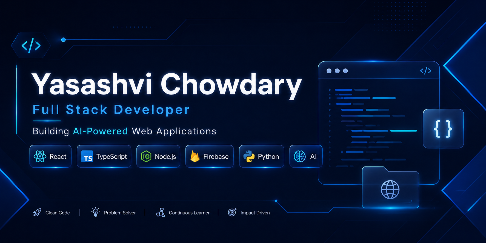

<!-- ========================================================= -->
<!--                       HERO BANNER                         -->
<!-- ========================================================= -->

  

<h1 align="center">
  Hi 👋 I'm Yasashvi Chowdary
</h1>

<h3 align="center">
  Full Stack Developer • AI Enthusiast • Building Scalable Web Applications
</h3>

  Third-Year Computer Science Engineering Student at Pragati Engineering College, passionate about creating modern, responsive, and AI-powered web applications using React, TypeScript, Node.js, Express, Firebase, and Python.

---

---

---

## 🚀 What I'm Building

✔ AI-Powered Web Applications

✔ Modern Full Stack Projects

✔ Responsive User Interfaces

✔ Scalable Backend Systems

✔ Clean & Maintainable Code

✔ Real-World Software Solutions

---
